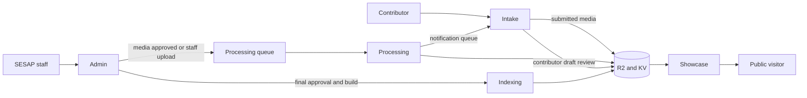

# Architecture

Five Cloudflare Workers share types in [`packages/types`](../packages/types/src) and storage bindings defined in each worker's `wrangler.example.toml`. The exact record and route shapes live in those types and the worker route files.

| Worker | Responsibility |
| --- | --- |
| Intake | Email verification, session and consent capture, upload, contributor draft review, and notification email. Public surface. |
| Admin | Staff upload, private media review, processing retry, final decisions, and build trigger. Requires Cloudflare Access outside development. |
| Processing | Consumes approved media jobs, transcribes and analyzes, writes artifacts, and queues notifications. |
| Indexing | Builds the public search and story artifacts from approved records. |
| Showcase | Serves approved public stories, search, and media presentation. |

Interview records and session pointers are in KV; media, consent archives, transcripts, analysis, and versioned build artifacts are in R2. The processing and notification queues connect the workers. See [`packages/types/src/storage.ts`](../packages/types/src/storage.ts) for keys and paths and [`packages/types/src/admin.ts`](../packages/types/src/admin.ts) and [`intake.ts`](../packages/types/src/intake.ts) for states.

A self submission begins at `pending_media_review`. Staff approve media before processing, then the contributor receives a draft review link after processing. Submitting that review returns the record to staff as `pending_review`. Staff approval marks public build data dirty; the admin build action regenerates the showcase artifacts. Staff sourced interviews enter by the admin route and do not use the contributor review gate. Rejection before analysis deletes submitted media. Later rejection may reopen a self submission for contributor changes within the revision limit; otherwise it is terminal.

Only the showcase build is intended for public story content. Intake has a public wizard and token guarded review route; admin records, email addresses, consent archives, raw media, and processing artifacts remain private. The current code does not package or transfer approved materials to OSU Library. See [operations](operations.md) for staff decisions and the [roadmap](roadmap.md) for launch work.
